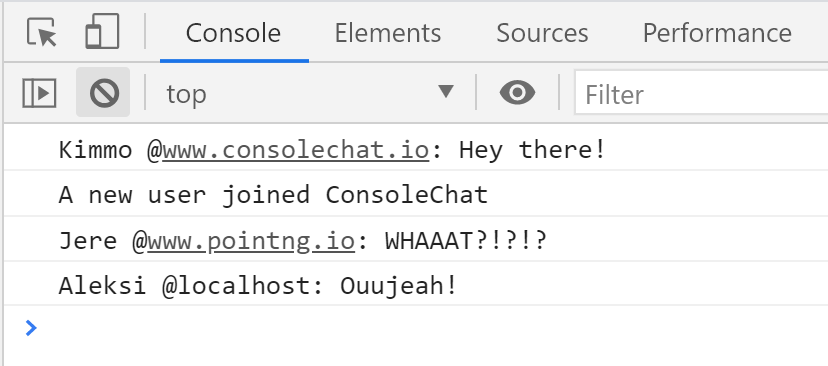

import { Link } from "gatsby"
import { FiInfo } from "react-icons/fi"

<section className="mdx-page">




<h1>H1 title</h1>

`console.log('hello there')`

**Offal 90's small batch lomo occupy. Quinoa art party single-origin coffee pabst. Drinking vinegar lyft chicharrones mlkshk echo park fam, chia leggings before they sold out banh mi umami trust fund polaroid slow-carb.** Pug actually humblebrag, distillery four loko slow-carb squid yuccie snackwave. _Pop-up live-edge kitsch viral_, DIY church-key taxidermy vice ugh poutine poke artisan.

<div className="code">


```js
const firstName = "john"
const lastName = "smith"
```

</div>


<div className="nice-text">
  <h3>Nice text</h3>
  <FiInfo className="nice-text-icon"></FiInfo>
  I'm baby la croix fashion axe enamel pin cliche, sustainable humblebrag vice viral
  pitchfork chartreuse banh mi mlkshk shaman brunch yuccie. Lomo fixie flannel, food
  truck artisan chillwave crucifix 8-bit vice venmo af you probably haven't heard
  of them. Coloring book heirloom fanny pack fashion axe wolf yr, crucifix butcher.
</div>

<h2>React components</h2>

```jsx
import React from "react"
import styled from "styled-components"
import { AiOutlineLike } from "react-icons/ai"
const LikeButton = () => {
  const [value, setValue] = React.useState(0)
  return (
    <Wrapper>
      <div>
        <button onClick={() => setValue(value + 1)}>
          <AiOutlineLike />
        </button>
        <p>
          Liked the post?
          <br />
          Click thumbs up few times
        </p>
      </div>
      <span>+{value}</span>
    </Wrapper>
  )
}
```

<h2>regular headin</h2>

<h2 title="true">title heading</h2>

<h4>blockquote element</h4>

<blockquote display="default">
  I'm baby la croix fashion axe enamel pin cliche, sustainable humblebrag vice
  viral pitchfork chartreuse banh mi mlkshk shaman brunch yuccie.
</blockquote>

<blockquote display="info">
  I'm baby la croix fashion axe enamel pin cliche, sustainable humblebrag vice
  viral pitchfork chartreuse banh mi mlkshk shaman brunch yuccie.
</blockquote>

<blockquote display="warning">
  I'm baby la croix fashion axe enamel pin cliche, sustainable humblebrag vice
  viral pitchfork chartreuse banh mi mlkshk shaman brunch yuccie.
</blockquote>

<blockquote>
  I'm baby la croix fashion axe enamel pin cliche, sustainable humblebrag vice
  viral pitchfork chartreuse banh mi mlkshk shaman brunch yuccie.
</blockquote>

#### Javascript

```js
// comments
const name = "john"
const channel = "coding addict"

function featuredProducts(data) {
  return data.filter(item => {
    return item.featured === true
  })
}
featuredProducts()
```

#### JSX

```jsx
import React from "react"

const Counter = () => {
  const [count, setCount] = React.useState(0)
  return (
    <section className="counter">
      <h4>show some love to MDX</h4>
      <h4>likes {count}</h4>
      <button className="btn btn-danger" onClick={() => setCount(count + 1)}>
        i like mdx
      </button>
    </section>
  )
}
export default Counter
```

#### HTML

```html
<h1>hello world</h1>
<p class="random">random text</p>
<section class="contact">
  <div class="title">
    <h1>contact us</h1>
  </div>
</section>
```

#### CSS

```css
max-width: 500px;
border-radius: var(--radius);
padding: 1rem 1.5rem;
background: var(--clr-grey-10);
text-align: center;
```

<Link to="/posts" className="btn center-btn">
  all posts
</Link>

</section>

