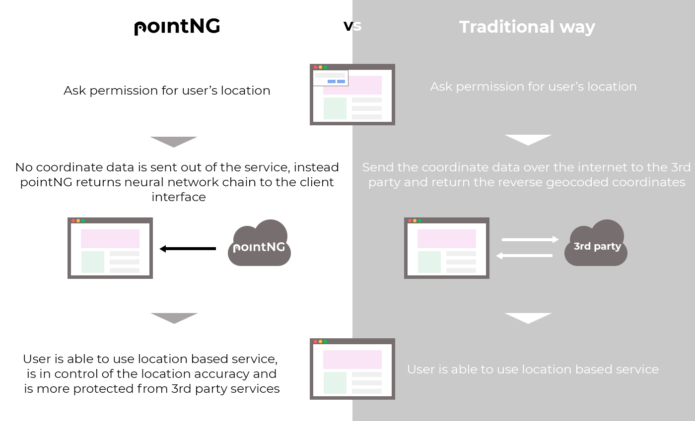

import { Link } from "gatsby"

The way location identification works today is something that we have come to accept without thinking about it too much. Is it because the existing method is perfect? Or is it because there has not been a better way to make location identification in the last couple of decades?

I think that everyone agrees that most digital services have a creepy way of asking/knowing our exact coordinates without clear reason why they need this level of accuracy.

In addition, to make this collected coordinate data actionable, digital services need to pass it, over the internet, to 3rd party services. This is not 100% safe because as long as coordinate data leaves the device and travels through the internet to 3rd parties, there are risks. Not to mention the potential GDPR & CCPA headaches resulting when you want just to do some really simple location personalized feature.

<b>Could we just make this location identification thing simpler and less creepy?</b>

## Meet pointNG — tool for privacy protected location identification

To solve this, we at Grew have created <a href="https://www.pointng.io" target="_blank">pointNG</a>, a technology that makes GPS-based location personalization as simple and safe as possible.

When a website visitor permits to use her/his location data, instead of sending sensitive location data over the internet, our technology fetches a series of pre-trained neural networks to identify the user’s location based on latitude and longitude coordinates.

This way, we can make sure the end-users’ coordinate data is safe, as we are not sending it away from the browser or device.

## Javascript integration with Edge Machine Learning

To make the solution usable, we created a Javascript SDK developer tool that uses approximately 5000 pre-trained neural networks stored on a CDN for location identification. The SDK contains easy to use functions for web-developers to start creating location-based services with pointNG technology.

<ul>
  <li>100% client-side: we don’t send any coordinate data away from the browser.</li>
  <li>Simple functions that developers can use to build location-based web services.</li>
  <li>User-centric: we have implemented a browser widget that gives the website’s end users the power to control her/his location tracking preferences.</li>
</ul>

<h2>So what are the benefits?</h2>

<ul>
  <li>pointNG enables companies to do better business through improved user experience without privacy compromises.</li>
  <li>Companies and developers can build location-based services faster, as there is less privacy-related work to do.</li>
  <li>It’s future proof. We can’t be sure how the legislation around location data will evolve, but using pointNG, companies can make sure the privacy-related risks are smaller now and in the future.</li>
  <li>Companies earn their end-users’ trust by offering high security.</li>
  <li>B2B Companies can build competitive location-based services that are easier to sell because the privacy-related risks are smaller for the buyer.</li>
</ul>

### Use case examples

The possible use cases where to use pointNG are many, such as:

<ul>
  <li>Personalizing content (images, texts, currencies etc.)</li>
  <li>Targeting banner ads and popups</li>
  <li>Redirecting users to localized sites</li>
  <li>Form-prefilling with location information</li>
</ul>

To start using pointNG on your website, sign up <a href="https://app.pointng.io/register" target="_blank">here</a>, plug pointNG into your website, and start building without privacy headaches.
