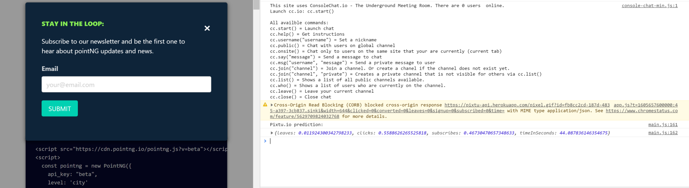

import { Link } from "gatsby"

When searching conversion optimization tools, I couldn't find a solution that is easy to implement, privacy-friendly, and that would allow us at Grew to personalize our front-end based on user behavior automatically. To achieve this I started to implement a machine learning based solution that uses event data (eg. time on page, bounce, link click, subscription, conversion, signup) and device related data (eg. device type, browser, time zone) to build a real-time conversion prediction system.

My goal is to keep the system safe and light by using only non-personal and non-sensitive data, and not use cookies. The idea is that when we have collected enough data, our model can create segments and audiences based on the input data for creating a prediction model that can identify in real-time during a website session the likelihood a visitor will convert.

Currently, the client-side package consists of two parts:

<ul>
  <li>
    1. A script that tracks and sends the website visitors' device and event data to a tracking API. By default, the script tracks bounce and click events and device-data, but I can pass any events using a simple function.
  </li>
  
  <li>
    2. A script that calls the prediction API, which returns the predicted action the user will take. The data also predicts how many seconds after the pageload the user will do the predicted action.
  </li>
</ul>

If you are interested, all the client-side scripts are in use in this <a href="https://github.com/Grew-dev/pixtu-cdn" target="_blank">Github repo</a>.

On the back-end, I use <a href="https://brain.js.org/" target="_blank">brain.js</a> neural network that categorizes the event and device data it gets from the 1st tracking API. The output is a prediction model that serves the action and timing predictions to the 2nd prediction API. We upload the trained neural networks to a mongoose database.

## Testing in production

We are currently testing the solution on our product pages. An example use case is currently live on <a href="https://www.pointng.io" target="_blank">pointng.io</a>, where we use the solution to optimize the timing and targeting of our newsletter subscription popups. If you want, you can go there and inspect the console to see what is your prediction.

Alternative, you can try the solution <a href="https://www.pixtu.io" target="_blank">here</a>.

## Next steps

After running the initial tests and analyzing the results, my plan is to develop this into a 'next-best-action' tool. Instead of running segment-based predictions, the solution should continuously update the predictions during a session according to the visitors' actions on the page. Let's see how far I get. I'll keep posting news about the progress.